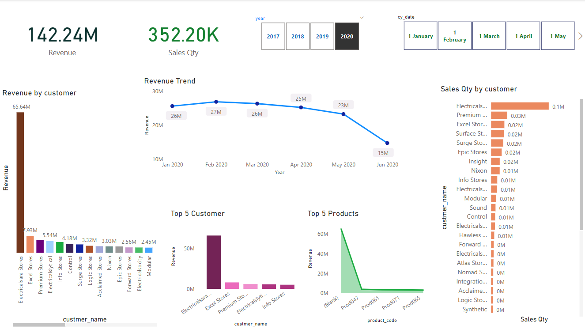
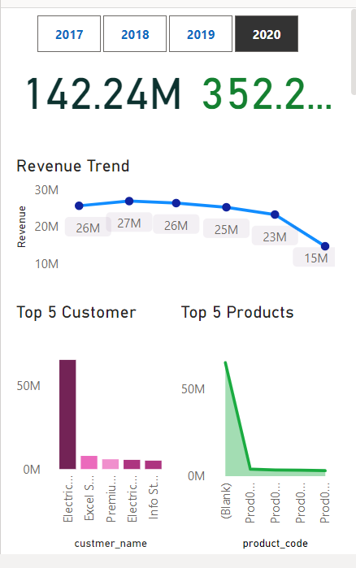
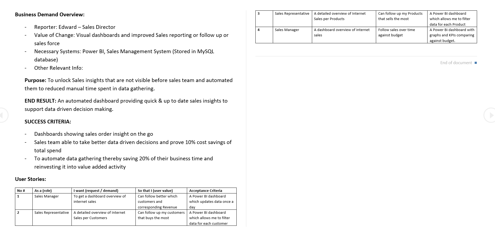
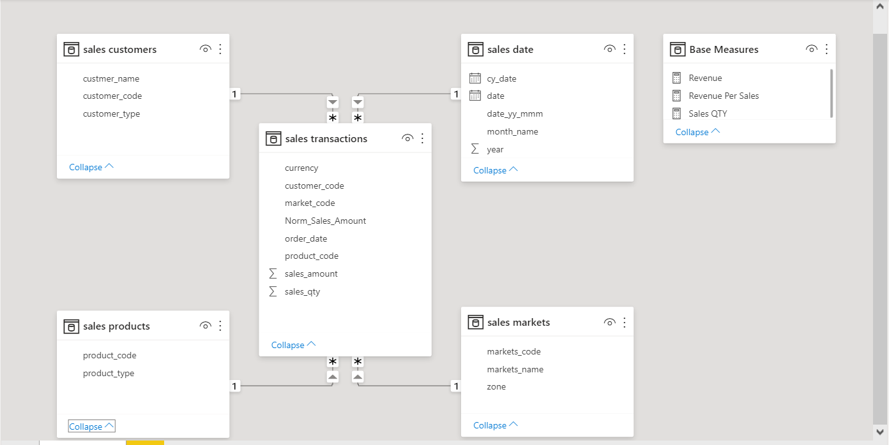
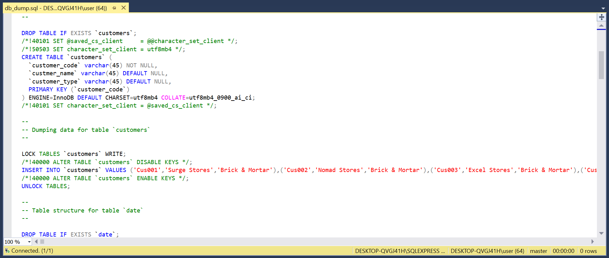
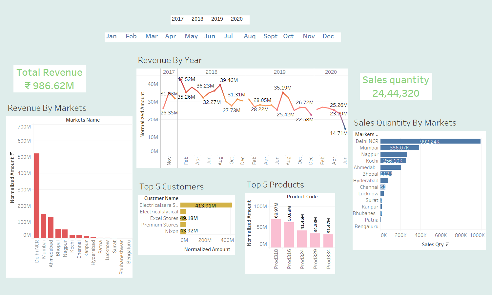

# Sales-Insight
## Dashboards On AtliQ Sales Data
**Over PowerBI**

<code>  </code>

**Mobile View**

<code>  </code>

## Problem Statement
*Identify and understand the challenges faced in sales tracking.*
## Project Overview
*The goal of this project is to develop a sales tracking system that will help businesses to overcome the challenges of sales tracking and gain valuable insights from their sales data.*

### Dashboard is designed to address the issues related to sales tracking and has following users:

*Marketers:* Use sales data to make marketing decisions.

*Management Team:* Requires sales reports for strategic planning.

## Workflow

1.Problem statement and data discovery: Phase of the project will involve identifying and understanding the challenges faced in sales tracking, as well as exploring the available sales data and understanding its structure.

<code>  </code>

2.Data Model and Relationships: A data model is established to define the relationships between various tables in the MySQL database. This may include implementing a star schema concept for efficient data retrieval.

<code>  </code>

3.Data analysis using SQL: Phase of the project will involve using SQL to query and analyze the sales data to gain insights into sales performance.

<code>  </code>

4.Data cleaning and ETL: Involve cleaning and transforming the sales data for reporting.

5.Dashboard development: Involve developing a dashboard to visualize the sales data and present it in a meaningful way.

**Over Tableau**
<code>  </code>

# Thank You
